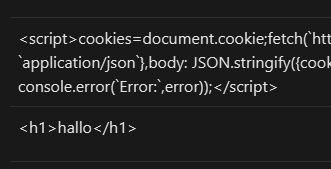

# SQL Injections
Verwendung der text-Funktion von SQLAlchemy: Diese Funktion wird verwendet, um einen SQL-Ausdruck mit einem benannten Parameter (in diesem Fall :projectname) zu erstellen. Dies stellt sicher, dass der Parameter projectname innerhalb der SQL-Abfrage sicher verwendet wird. Beim Ausführen der Abfrage wird der Parameter projectname in einem Dictionary übergeben. SQLAlchemy kümmert sich um das sichere Handling dieses Parameters, indem es Zeichen escapet und die Ausführung von SQL-Code verhindert.

Statt:
    query_project_id = f"SELECT id FROM project WHERE title = '{projectname}'"
    result_project_id = db.session.execute(text(query_project_id))
    project_id = result_project_id.fetchall()[0][0]

nun:
    query_project_id = text("SELECT id FROM project WHERE title = :projectname")
    result_project_id = db.session.execute(query_project_id, {'projectname': projectname})
    project_id = result_project_id.fetchall()[0][0]

Das habe ich bei allen Routen und SQL Statements umgesetzt.

# XSS
Dieses keyword "safe" muss in der tasks.html entfernt werden:
    "<td>{{ todo[1] | safe }}</td>" wird zu: 
    "<td>{{ todo[1] }}</td>"

# Brute Force
Hier helfen sichere generierte Passwörter!
